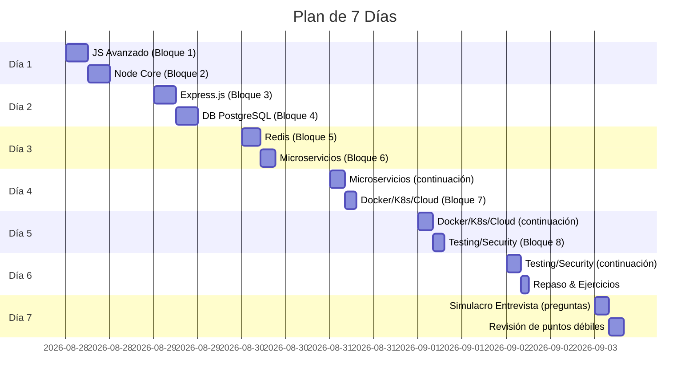
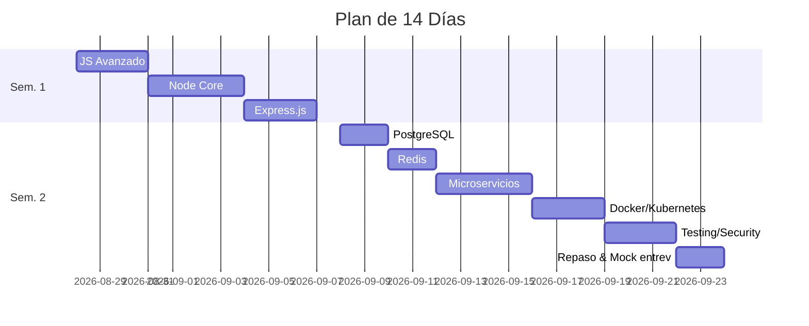

# Plan de Estudio y Cronograma

Este plan flexible contempla dos horizontes: 7 días intensivos o 14 días detallados, para cubrir los 8 bloques temáticos con prioridad, dificultad y horas estimadas.

## Tabla de Temas vs Prioridad/Dificultad/Horas

| Bloque                         | Prioridad | Dificultad | Horas Totales Estimadas |
| ------------------------------ | --------- | ---------- | ----------------------- |
| 1. JavaScript Avanzado         | Alta      | Media      | 6 h                     |
| 2. Node.js Core (Event Loop)   | Alta      | Alta       | 6 h                     |
| 3. Express.js (APIs)           | Alta      | Media      | 6 h                     |
| 4. PostgreSQL (SQL, ACID)      | Alta      | Alta       | 6 h                     |
| 5. Redis & Caché               | Media     | Media      | 5 h                     |
| 6. Microservicios/Arquitectura | Alta      | Alta       | 8 h                     |
| 7. Docker/Kubernetes/Cloud     | Media     | Alta       | 7 h                     |
| 8. Testing y Seguridad         | Alta      | Alta       | 7 h                     |

- **Prioridad:** Basada en relevancia común en entrevistas y rol _Senior Back-End_.
- **Dificultad:** Estimada según complejidad del tema.
- **Horas Totales:** Suma de subtemas y práctica por bloque.

## Calendario 7 Días

_(Diagrama Gantt ejemplo en formato mermaid)_

## Calendario 14 Días (flexible)

_(Timelapse semanal para más detalle)_

**Nota:** Este cronograma puede adaptarse según conocimientos previos. Por ejemplo, si ya dominas JavaScript, dedicar menos tiempo al Bloque 1 y más a temas avanzados. Es recomendable intercalar teoría con práctica diaria.

## Comparación por Prioridad y Horas

Por prioridad, enfocar primero bloques (1,2,3,4,6,8) que tienen _Alta relevancia_. Los bloques 5 y 7 quedan _medios_, pero no son triviales. El plan asegura cubrir los temas críticos con tiempo para práctica y revisión.

Cada archivo contiene el resumen ejecutivo, teoría, ejemplos, preguntas de entrevista, ejercicios con soluciones, fuentes citadas y tiempo estimado según lo descrito en esta propuesta.
