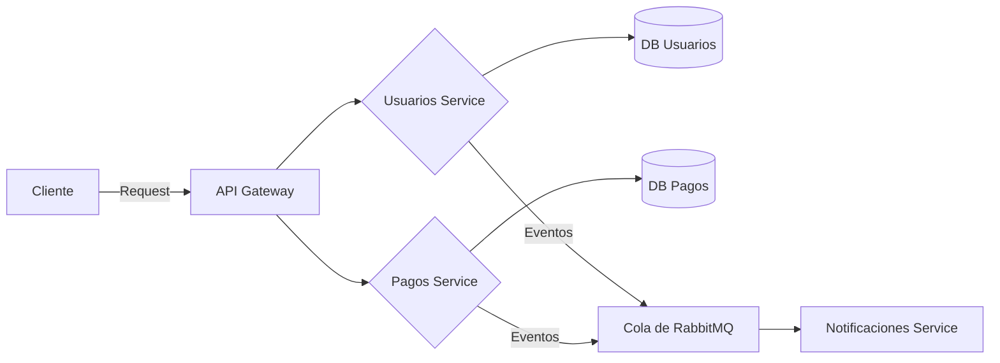

# Bloque 6: Arquitectura de Microservicios

## Resumen Ejecutivo

La arquitectura de microservicios divide una aplicación en servicios pequeños e independientes que se comunican entre sí. Node.js, con su modelo ligero y orientado a eventos, encaja bien en esta arquitectura. Este bloque cubre los principios de diseño (servicios autónomos, despliegue independiente), patrones comunes (API Gateway, Circuit Breaker, Eventos), y comunicación (REST, gRPC, colas de mensajes). Se discutirán ventajas (escalabilidad, despliegue ágil) y retos (complejidad operativa, testing distribuido). Incluir diagramas mermaid ayudará a visualizar flujos y componentes.

## Material Teórico Detallado

- **Definición:** Los microservicios son servicios pequeños que realizan funciones específicas. Cada servicio es desplegable y escalable por separado. Node.js se ajusta bien debido a su **bajo consumo de memoria** y rápido arranque.
- **Ventajas clave:** Scalabilidad horizontal (fácil duplicar servicios), despliegue independiente, tecnología por servicio, tolerancia a fallos (un fallo afecta sólo a un servicio), ciclo de desarrollo más rápido por equipo. Según [HDWebsoft], Node.js junto con microservicios ofrece _“rendimiento orientado a eventos… arquitectura modular e independientemente desplegable”_.
- **Patrones de diseño:**
  - _API Gateway:_ Punto único de entrada que enruta peticiones al servicio apropiado y puede manejar autenticación/compressión.
  - _Circuit Breaker:_ Patrón de resiliencia para evitar cascadas de fallos; corta llamadas a un servicio con errores repetidos y permite recuperación. Herramientas: _Hystrix_, _Openssl-circuit-breaker_.
  - _Service Discovery:_ Registro de servicios (p.ej. Consul, etcd) para encontrar dinámicamente servicios en arquitectura cambiante.
  - _Event-driven:_ Uso de mensajería asíncrona (RabbitMQ, Kafka) para desacoplar servicios. Se generan eventos en vez de invocaciones directas.
  - _CQRS + Event Sourcing:_ Separación de comandos/consultas y almacenamiento de eventos (avanzado).
- **Comunicación entre servicios:**
  - _REST/HTTP:_ Protocolo común para APIs. Node.js con Express facilita exponer endpoints.
  - _gRPC:_ RPC eficiente usando Protobuf, soportado en Node. Útil para baja latencia entre servicios.
  - _Mensajería:_ Brokers (RabbitMQ, Kafka, o Redis pub/sub) para comunicación asíncrona. Node.js es adecuado para suscribirse/publicar eventos debido a su ciclo de eventos.
- **Desafíos:**
  - _Operacional:_ Más servicios = más despliegues, logs, monitoreo. Se requieren prácticas DevOps robustas (CI/CD, containerización).
  - _Pruebas:_ Testear microservicios distribuidos es complejo (contratos API, entornos simulados). Se aplican _contract tests_ (Pact) y testing de integración.
  - _Consistencia:_ Transacciones distribuidas son difíciles (se usan sagas o compensaciones en vez de ACID global).
- **Node.js específico:**
  - Varios servicios pueden compartir tecnologías (JS en frontend/backend).
  - Node habilita _full-stack JavaScript_, compartiendo validadores o modelos (TypeScript).
  - Ventajas de Node citadas en [38†L563-L572]: non-blocking I/O, motor V8 rápido, arranque ligero, ecosistema npm, etc.

## Ejemplos Prácticos y Diagramas



_Diagrama:_ Cliente envía petición al API Gateway, que enruta a servicios de Usuarios o Pagos. Los servicios usan sus propias bases de datos. A su vez, publican eventos en cola para el servicio de Notificaciones.

```js
// Ejemplo esquemático: envío de evento tras crear recurso
// Servicio de Usuarios (Node.js)
const express = require('express'),
  kafka = require('kafkajs');
const app = express();
const { Kafka } = kafka;
const producer = new Kafka({ brokers: ['kafka:9092'] }).producer();

app.post('/usuarios', async (req, res) => {
  const user = req.body; // validar...
  // Guardar usuario en DB (simulado)
  const newUser = { id: 123, ...user };
  // Publicar evento
  await producer.connect();
  await producer.send({
    topic: 'usuariosCreado',
    messages: [{ key: 'user', value: JSON.stringify(newUser) }],
  });
  await producer.disconnect();
  res.status(201).json(newUser);
});
app.listen(4000);
```

En este snippet, al crear un usuario se publica un evento en Kafka (`usuariosCreado`). Otros servicios pueden suscribirse a este evento para acciones como envío de email de bienvenida.

## Preguntas Comunes de Entrevista

- **¿Qué es un microservicio?**  
  Servicio autónomo que realiza una función específica. Los servicios se comunican por APIs/colas. Los microservicios no comparten código o base de datos por defecto.
- **Ventajas vs Monolito:**  
  _Ventajas:_ despliegue independiente, escalabilidad por componente, aislamiento de fallos. _Desventajas:_ complejidad de operaciones, dificultad en tests integrados, latencia inter-servicio.
- **¿Cómo manejarías transacciones distribuidas?**  
  Usualmente se evitan y se usan sagas. Un ejemplo es la **SAGA**: divide la transacción global en pasos locales con posibles compensaciones. P.ej., reserva en un servicio y en caso de fallo ejecutar lógica inversa.
- **¿Qué es un API Gateway?**  
  Punto de entrada unificado. Se encarga de enrutamiento, autenticación y agregación de llamadas. Oculta la complejidad de múltiples servicios al cliente.
- **¿Cómo escalarías microservicios con Node?**  
  _Horizontalmente_: múltiples réplicas detrás de balanceador (p.ej. K8s). Emplear _auto-scaling_ según CPU o colas.
- **Patrones de resiliencia:**  
  Circuit Breaker (p.ej. _Hystrix_, _Opossum_ en Node) para evitar fallos en cascada. Bulkhead (aislamiento de recursos). Rate Limiting (evitar sobrecarga).

## Ejercicios Prácticos

1. **Diseño de Arquitectura:** Dado un sistema de pedidos online (usuarios, inventario, pagos, envíos), dibuja un esquema de microservicios con comunicación por APIs/colas. Señala dónde iría un API Gateway, colas de mensajes, bases de datos separadas, y cómo se realizaría el checkout.
2. **Implementación simple:** Crea dos pequeños servicios Node: _A_ expone `GET /data` que devuelve un JSON, _B_ expone `GET /external` que llama internamente a _A_ (usando `fetch` o Axios). Usa `Promise`/`async` para la llamada y maneja error si _A_ no responde (por ejemplo, con try/catch). Es un mini-ejemplo de dependencia entre microservicios.
3. **Prueba de Contrato:** Usa la librería [Pact](https://docs.pact.io) (en Node) para generar un contrato de consumidor/servicio entre dos servicios ficticios (se puede simular con un simple JSON). Esto ilustra cómo documentar APIs de microservicios.

## Fuentes Clave y Lecturas

- _HDWebsoft Blog:_ "Microservicios con Node.js..." (guía en español).
- _Microsoft Patterns & Practices:_ Architectural guides (en inglés) sobre microservicios.
- _Crockford (seminal papers):_ [Design Principles of RESTful Services].
- _Mermaid.js:_ para diagramas de arquitectura (como el anterior).

## Tiempo de Estudio Estimado

- _Conceptos de microservicios:_ 2 horas (artículos generales y la fuente).
- _Patrones de diseño:_ 2 horas (Circuit Breaker, API Gateway, eventos).
- _Comunicación entre servicios:_ 1.5 horas (REST vs gRPC vs mensajería).
- _Diagramas y planificación:_ 1 hora (dibujar flujos mermaid).
- _Ejercicios prácticos:_ 2 horas.
