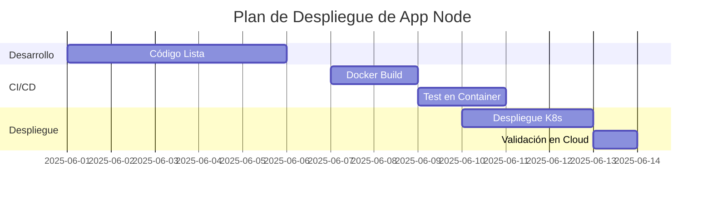

# Bloque 7: Contenedores, Kubernetes y Nube

## Resumen Ejecutivo

Para un Senior Backend es esencial saber desplegar aplicaciones a escala. Este bloque abarca **Docker** (crear imágenes y contenedores) y **Kubernetes** (orquestación de contenedores). Se muestra cómo dockerizar una aplicación Node.js, configurar `Dockerfile` y `docker-compose`. Luego se explican los componentes básicos de K8s: _pods, deployments, services, configmaps_, con ejemplos en YAML. Finalmente, se revisa despliegue en la nube (AWS/GCP): p.ej. Amazon ECS/EKS o Google Cloud Run. Las buenas prácticas incluyen desplegar múltiples réplicas, usar variables de entorno seguras y monitoreo. Se incluirán diagramas de flujo de despliegue y ejemplos de comandos CLI.

## Material Teórico Detallado

- **Docker:** Tecnología de contenedores que empaqueta la aplicación y sus dependencias en una imagen ligera.
  - _Dockerfile:_ especifica la imagen base (ej. `node:18-alpine`), copia código y corre comandos. Ejemplo:
    ```dockerfile
    FROM node:18-alpine
    WORKDIR /app
    COPY package*.json ./
    RUN npm install --production
    COPY . .
    CMD ["node", "index.js"]
    ```
  - _Construir y ejecutar:_ `docker build -t miapp .` y `docker run -p 3000:3000 miapp`. El contenedor lleva el entorno Node completo.
  - _docker-compose:_ Permite definir varios servicios (app, base de datos, redis) en un archivo YAML. Facilita desarrollo local.
- **Kubernetes:** Sistema de orquestación de contenedores.
  - _Pod:_ unidad mínima, agrupa uno o varios contenedores (normalmente uno).
  - _Deployment:_ mantiene un conjunto de pods replicados. Define cuántas réplicas.
  - _Service:_ expone los pods (p.ej. tipo ClusterIP o LoadBalancer para acceso externo).
  - _ConfigMap/Secret:_ almacenar configuración/externalizar credenciales.
  - _Ejemplo simple:_ Desplegar un _deployment_ de la app Node:
    ```yaml
    apiVersion: apps/v1
    kind: Deployment
    metadata: { name: miapp-deploy }
    spec:
      replicas: 3
      selector: { matchLabels: { app: miapp } }
      template:
        metadata: { labels: { app: miapp } }
        spec:
          containers:
            - name: miapp
              image: miapp:latest
              ports: [{ containerPort: 3000 }]
    ```
  - _Comandos útiles:_ `kubectl apply -f despliegue.yaml`, `kubectl get pods`, `kubectl logs pod-name`.
- **Nube (AWS/GCP):**
  - _AWS:_
    - _ECS/EKS:_ ECS maneja contenedores (vía Fargate o EC2), EKS es Kubernetes administrado.
    - _Lambda:_ para Node.js sin servidor, aunque menos usado en APIs REST complejas (se explicaría brevemente).
  - _GCP:_
    - _Cloud Run:_ despliegue serverless de contenedores Docker.
    - _GKE:_ Kubernetes gestionado similar a EKS.
  - _Despliegue CI/CD:_ integrarlo con pipelines (GitHub Actions, AWS CodeDeploy), automatización.
- **Buenas prácticas:**
  - Mantener imágenes pequeñas (usar base _alpine_, `.dockerignore`).
  - Usar healthchecks (`HEALTHCHECK` en Docker o probes en K8s) para detectar caídas.
  - No correr contenedores como root, establecer _user_ en Dockerfile.
  - Escalamiento automático (HPA en K8s) basado en métricas (CPU, cola de mensajes).
- **Monitoring y Logging:**
  - _Logs:_ Redirigir stdout/stderr, usar volúmenes o soluciones ELK/CloudWatch.
  - _Métricas:_ Prometheus + Grafana, o servicios en nube (CloudWatch, Stackdriver).
  - _Alertas:_ Configurar alertas para **Downtime** o uso elevado.

## Ejemplos Prácticos (YAML y CLI)

```yaml
# docker-compose.yml: app Node + base de datos (Postgres) + Redis
version: '3.8'
services:
  app:
    build: .
    ports:
      - '3000:3000'
    environment:
      - DATABASE_URL=postgres://user:pass@db:5432/miapp
      - REDIS_URL=redis://cache:6379
    depends_on:
      - db
      - cache
  db:
    image: postgres:15-alpine
    environment:
      - POSTGRES_USER=user
      - POSTGRES_PASSWORD=pass
    volumes:
      - db_data:/var/lib/postgresql/data
  cache:
    image: redis:latest

volumes:
  db_data:
```

Con `docker-compose up`, se crean 3 contenedores: la app Node, un Postgres y un Redis, enlazados en red interna.

```bash
# Kubernetes: crear Deployment y Service
kubectl apply -f miapp-deployment.yaml
kubectl apply -f miapp-service.yaml
# Por ejemplo, Service YAML:
# apiVersion: v1
# kind: Service
# metadata: { name: miapp-service }
# spec:
#   type: LoadBalancer
#   selector: { app: miapp }
#   ports: [ { port: 80, targetPort: 3000 } ]
```

La Service de tipo LoadBalancer en AWS/GCP expondrá la app al exterior. En minikube usaríamos NodePort.



_Diagrama de Gantt:_ ejemplo de timeline para preparar la aplicación, construir la imagen y desplegar en Kubernetes.

## Preguntas Comunes de Entrevista

- **¿Cuál es la diferencia entre contenedor y máquina virtual?**  
  Un contenedor comparte el kernel del host y aísla procesos. Es más ligero y arranca rápido comparado con una VM completa.
- **¿Qué es un Pod en Kubernetes?**  
  Unidad básica que ejecuta uno o más contenedores (normalmente uno) en K8s. Un Pod tiene IP propia. Los Pods son efímeros y se administran mediante Deployments.
- **¿Cómo escalarías un servicio en Docker?**  
  Con `docker-compose scale` (v2 de compose) o mejor aún orquestadores: Docker Swarm o Kubernetes, configurando múltiples réplicas del contenedor.
- **¿Qué es un Ingress?**  
  Recurso de K8s para reglas de enrutamiento HTTP. Permite exponer múltiples servicios detrás de una sola IP o dominio, definiendo reglas (hosts, paths).
- **¿Por qué usar variables de entorno en Docker/K8s?**  
  Para configurar la aplicación en tiempo de despliegue (credenciales, endpoints) sin modificar la imagen. Las _Secrets_ de K8s almacenan info sensible.
- **Despliegue en AWS:**  
  AWS Fargate (serverless con ECS), ECS clásico en EC2, EKS (Kubernetes). _¿Serverless vs contenedores?_ Los lambdas son buenos para funciones cortas; para apps con estado o escuchas, se prefiere contenedores.

## Ejercicios Prácticos

1. **Dockerizar Aplicación Node:** Escribe un `Dockerfile` para una app Node (usa `node:18`). Construye la imagen y verifica que corra con `docker run` (mostrar logs).
2. **Múltiples contenedores:** Crea un `docker-compose.yml` para tu app Node + PostgreSQL + Redis. Haz que Node se conecte usando hostnames de servicios. Levanta el stack y verifica comunicación (p.ej. crear un registro en Postgres usando la app).
3. **Despliegue en Minikube:** Inicializa Minikube local. Aplica un Deployment (2 réplicas) y un Service NodePort. Accede a la app via `minikube service`. Establece escalado automático básico: `kubectl autoscale deployment miapp-deploy --cpu-percent=70 --min=2 --max=5`.

## Fuentes Clave y Lecturas

- _Docker Docs:_ Guía de Primeros Pasos (Dockerfile, Compose).
- _Kubernetes Documentation:_ Tutorial de _gaston deploy your first app_.
- _AWS Official:_ Guías de ECS/EKS y Lambda para Node.js.
- _Google Cloud Run Docs:_ Despliegue de contenedores Node.js (en inglés).
- _Mermaid Gantt/Tikz:_ documentación de diagramas de Gantt para cronogramas.

## Tiempo de Estudio Estimado

- _Docker básico:_ 1 hora (Dockerfile, comandos build/run).
- _docker-compose:_ 0.5 horas (montar varios contenedores).
- _Kubernetes Core:_ 2 horas (pods, deployments, services con YAML).
- _Despliegue Cloud:_ 1 hora (leer guías específicas AWS/GCP).
- _Ejercicios prácticos:_ 2 horas.
